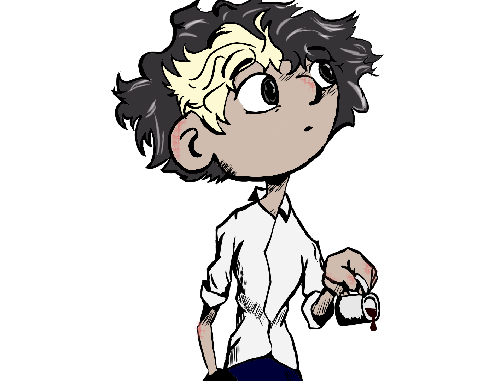

<h1>Hola!, soy Luciano Illuminati</h1>

Soy estudiante de Tecnicatura en Programacion. Los lenguajes de programación que domino son C#, Javascript, HTML, CSS y PHP, pero tengo especial manejo de Python. Me encanta aprender y construir cosas nuevas, productivas, innovadoras y creativas.   
Me interesan el diseño web, el desarrollo de sofware y el marketing digital 
- Actualmente estoy aprendiendo ... 
  - Bootstrap  
  - React js   
- Fuera de la tecnología, me gusta leer comics, mangas y libros, tambien dibujary escuchar música. 
- 📫 Puedes contactarme en: <a href="luciano.illuminati17@gmail.com">luciano.illuminati17@gmail.com</a>  

<h2>Mira mis repositorios en GitHub</h2>

  

    
    
  

<h4> Languages </h4>
 
  
  
  
  
  
  
  

<h4> Other Tools and Technologies </h4>

  
  
  
  
  

<h2>Check out my Social Media</h2>

<h2>Github stats:</h2> 

